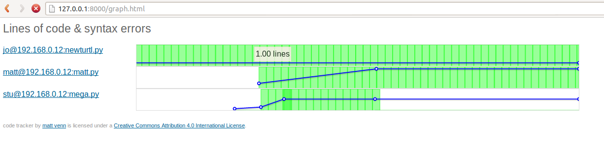

# Visual Code tracking 

The idea is to help understand how people learn to code, and to be able to give specific help when it's required.

By fetching the student's code regularly we can look at a some basic metrics to better understand their progress:

* syntax errors - using the Python compile library
* lines of code

These are plotted against time and shown using your browser. 

Code is added to a local git repo for change tracking and later we could add some kind of code browsing functionality.

# Setup on student's computer

    cd work
    mkdir myname
    cd myname
    #edit code (with correct extension)

The newest file in each student's directory in ~/work will be used for code tracking.

# Setup on main pc

* edit config.py to add hosts for scp, change file extension etc.
* run ./init.py to create local repo and initialise,
* regulary run ./fetch.py to fetch all work
* regulary run ./generate.py to create the graph.html
* I serve the file with `python -mSimpleHTTPServer` and fetch from [http://127.0.0.1/graph.html]

## Problems getting ./generate to run?

* generate will create a graph only when there are least 2 versions of 1 file in the repo
* fetch.py will only fetch all files but only add files with the correct extension to the repo
* file extension and host ips are set in config.py

# Requirements

* flot graphing, download and extract in the directory https://github.com/flot/flot

# Todo

* browse versions of code
* capture git stdout for less messy output while running

# License

Code tracker by Matt Venn is licensed under a Creative Commons Attribution 4.0 International License.
